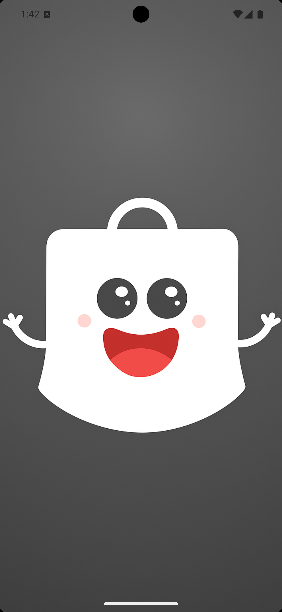
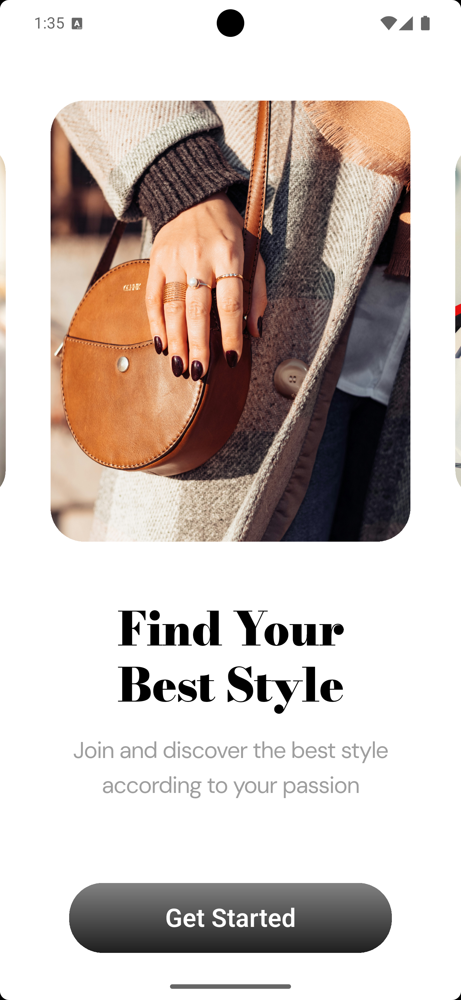
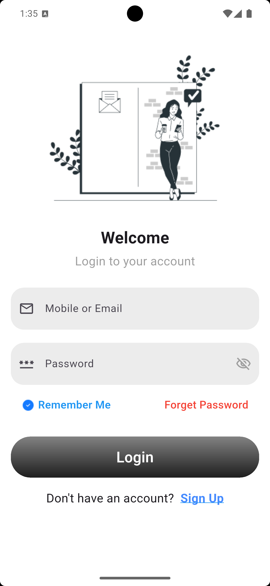
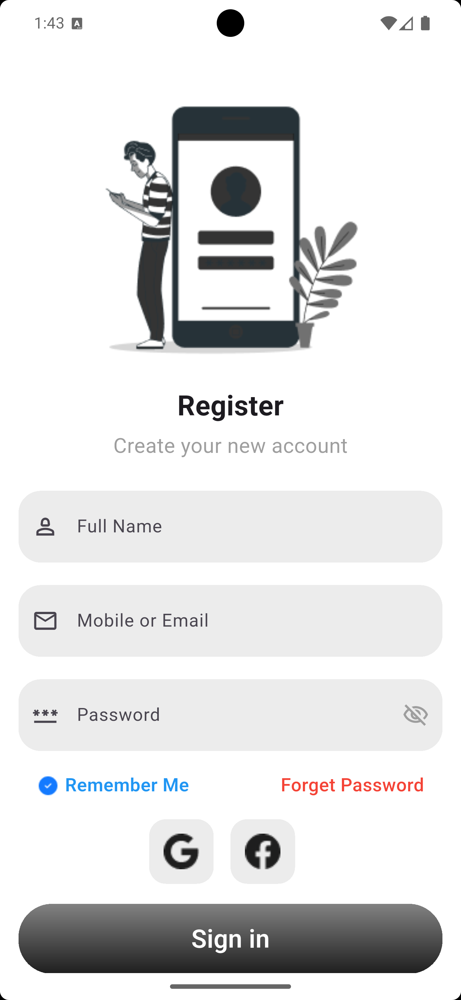
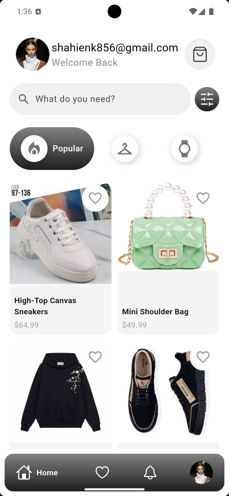
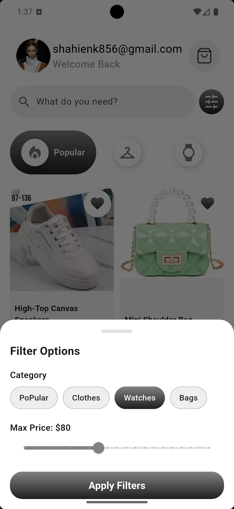
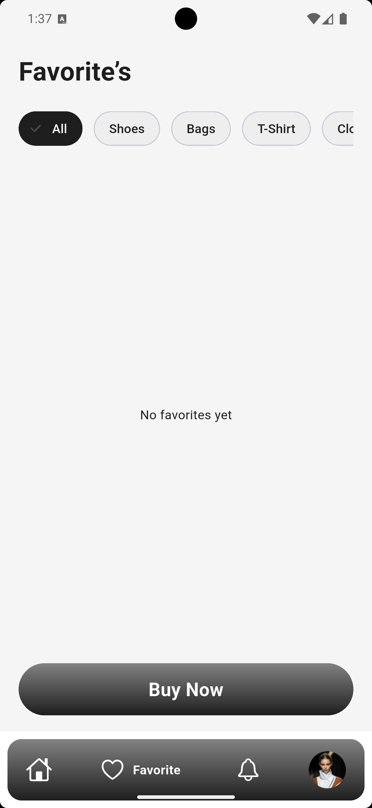
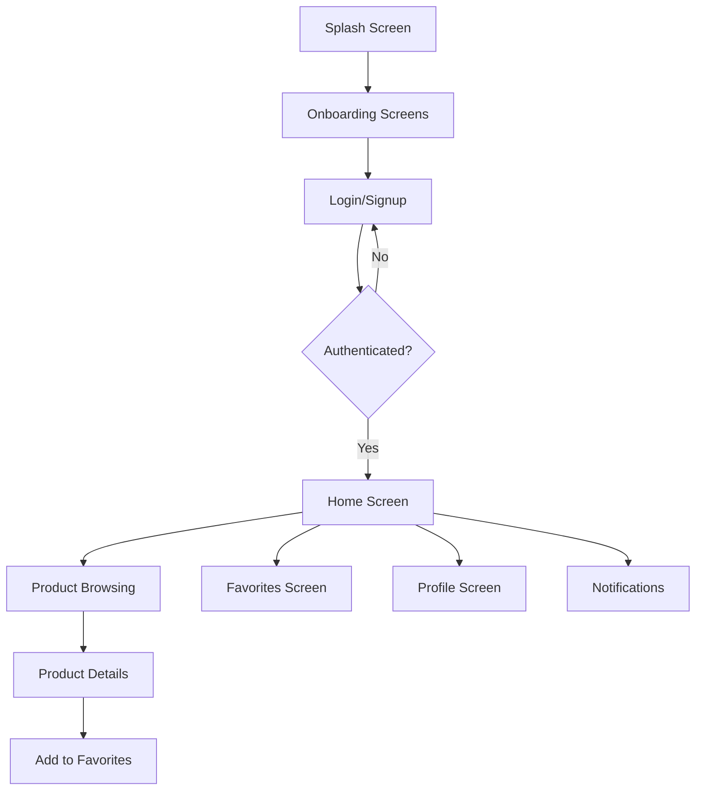

# Shopping App

A modern, feature-rich shopping application built with Flutter. This app provides a seamless shopping experience with Firebase integration for authentication and product management, featuring a clean architecture and intuitive user interface.

## 📱 Screenshots

<p align="center">
  
  
  
  
</p>

<p align="center">
  
  
  
</p>

## 🌟 Features

- **User Authentication**: Secure sign up and login with Firebase Authentication
- **Product Browsing**: Browse products by categories (Clothes, Shoes, Watches, Bags)
- **Product Details**: Detailed view of products with images and descriptions
- **Favorites**: Save your favorite products for quick access
- **User Profile**: Manage personal information and account settings
- **Product Filtering**: Filter products by category and price
- **Search Functionality**: Search for products by name
- **Responsive Design**: Works seamlessly on mobile devices

## 🛠️ Technologies & Packages

### Core Technologies
- **Flutter**: Cross-platform mobile development framework
- **Dart**: Programming language for Flutter
- **Firebase**: Backend-as-a-Service for authentication and data storage

### Key Packages
- **flutter_bloc**: State management using the BLoC pattern
- **firebase_core**: Core Firebase integration
- **firebase_auth**: Firebase Authentication
- **cloud_firestore**: Cloud Firestore database
- **google_nav_bar**: Beautiful navigation bar
- **go_router**: Advanced routing and navigation
- **google_fonts**: Custom font integration

## 🏗️ Architecture

The app follows a clean architecture with BLoC pattern for state management:

```
lib/
├── core/                       # Shared logic and utilities
│   ├── color_manager/          # App color definitions
│   ├── firebase/               # Firebase database operations
│   ├── routes/                 # App routing configuration
│   ├── style/                  # App styling
│   ├── utils/                  # Utility functions
│   └── widget/                 # Reusable UI components
└── feature/                    # Feature-based modules
    ├── authentication/         # User authentication system
    │   ├── cubit/              # Authentication state management
    │   ├── login_screen/       # Login interface
    │   ├── signup_screen/      # Registration interface
    │   ├── models/             # User model
    │   └── widget/             # Authentication UI components
    ├── favorite_screen/        # Favorites management
    ├── home/                   # Main home interface
    ├── home_screen/            # Product browsing functionality
    │   ├── cubit/              # Product state management
    │   ├── model/              # Product model
    │   └── widget/             # Product UI components
    ├── notification_screen/    # Notifications
    ├── onboarding_screen/      # Onboarding experience
    ├── order_details/          # Order details interface
    ├── profile_screen/         # User profile
    ├── show_product_details/   # Product details view
    └── splash_screen/          # Splash screen
```

## 🔄 App Flow



## 🎨 UI/UX Design

### Color Palette
- **Primary Gradient**: Used for buttons and accents
- **White**: Background and clean elements
- **Black/Gray**: Text and secondary elements

### Navigation
- Bottom navigation bar for easy access to main sections
- Intuitive flow from splash to onboarding to authentication
- Smooth transitions between screens

## 🚀 Getting Started

### Prerequisites
- Flutter SDK (3.8.1 or higher)
- Dart SDK
- Android Studio or VS Code
- Firebase account

### Installation

1. Clone the repository:
   ```bash
   git clone https://github.com/your-username/shopping_app.git
   ```

2. Navigate to the project directory:
   ```bash
   cd shopping_app
   ```

3. Install dependencies:
   ```bash
   flutter pub get
   ```

4. Set up Firebase:
   - Create a Firebase project at [Firebase Console](https://console.firebase.google.com/)
   - Add your Android/iOS app to the Firebase project
   - Download `google-services.json` (Android) and `GoogleService-Info.plist` (iOS)
   - Place these files in their respective directories
   - Run `flutterfire configure` to generate Firebase options

5. Run the app:
   ```bash
   flutter run
   ```

## 📁 Project Structure

The app follows a feature-first architecture where each major functionality is organized in its own directory under `lib/features/`:

```
features/
├── authentication/             # User authentication system
│   ├── cubit/                  # Authentication BLoC/Cubit
│   ├── models/                 # User data model
│   ├── login_screen/           # Login UI
│   ├── signup_screen/          # Signup UI
│   └── widget/                 # Authentication widgets
├── home/                       # Main home screen
├── home_screen/                # Product browsing
│   ├── cubit/                  # Product BLoC/Cubit
│   ├── model/                  # Product data model
│   └── widget/                 # Product widgets
├── favorite_screen/            # Favorites management
├── profile_screen/             # User profile
├── onboarding_screen/          # Onboarding flow
├── splash_screen/              # Initial screen
└── show_product_details/       # Product detail view
```

## 🔐 Firebase Integration

The app uses Firebase for:
- **Authentication**: Email/password sign up and login
- **Firestore**: Storing user data, products, and favorites
- **Real-time Updates**: Instant synchronization of user favorites

## 📱 Responsive Design

The app is designed to work on:
- **Mobile**: Primary target platform with optimized layouts
- **Adaptive UI**: Responsive design for different screen sizes

## 🧪 Testing

The app includes:
- Unit tests for business logic in the `test/` directory
- BLoC state management tests
- Widget tests for UI components

To run tests:
```bash
flutter test
```

## 🤝 Contributing

1. Fork the repository
2. Create a feature branch (`git checkout -b feature/AmazingFeature`)
3. Commit your changes (`git commit -m 'Add some AmazingFeature'`)
4. Push to the branch (`git push origin feature/AmazingFeature`)
5. Open a pull request

## 📄 License

This project is licensed under the MIT License - see the [LICENSE](LICENSE) file for details.

## 🙏 Acknowledgements

- [Flutter](https://flutter.dev/)
- [Firebase](https://firebase.google.com/)
- [Material Design](https://material.io/)
- [BLoC Pattern](https://bloclibrary.dev/)

## 🚀 Additional Features

- **Product Categories**: Clothes, Shoes, Watches, Bags
- **Favorite Management**: Save and manage favorite products
- **Product Search**: Search products by name
- **Product Filtering**: Filter by category and price range
- **Secure Authentication**: Firebase-based user authentication
- **Modern UI/UX**: Clean and intuitive interface design

## 📞 Support

For support, please open an issue in the GitHub repository or contact the development team.

---

Made with ❤️ using Flutter